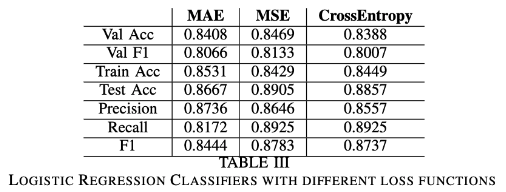

# Machine Learning : Assignment 1	

In this assignment classical machine learning algorithms (some of which are not used now but form the basis for deep learning) are used for classification and regression problems. These include Maximum Likelihood Estimation, Gaussian Mixture Model, Bayes Classifiers, and non parametric methods like KNN and parzen windows. Experimental results are reported to understand the effect and performance of these algorithms. All the code used is written from scratch. The problem statement of the assignment is available [here](./409_2020_Assignment_1.pdf) and detailed report of the work can be found [here](./Report.pdf).

## Regression Problem : Predicting Temperature 

To solve the regression problem we take a linear (in phi(x)) hypothesis function and use MSE loss function. The scripts can be found [here](./Scripts/Q1/).

1. **Bias Variance decomposition**: finding the best degree of polynomial if we take phi(x) as polynomial function

2. Experimentally we found that the closed form solution and gradient-based optimization solution of OLS are same.
3. **Regularized Least Squares:** studying the impact of L1 and L2 regularizers on the weights of the model

## Binary Classification on Health Data

The scripts for this part can be found [here](./Scripts/Q2/).

1. **Maximum Likelihood Estimation:** In this part we use classical ML method of MLE to estimate the class-conditional densities. The columns show the assumed form of the probability density functions and the results are reported below:

   

2. **Logistic Regression:** 

3. **Non parameteric methods** are also used and the results are reported in the report. 

The comparison of all the methods is show below using **AUC-ROC curves**:

## Multi-Class Classification on Medical Data 

In this part a 1-layer neural network is implemented to classify input data among 6 classes. The experiments using different loss functions, and non-parametric methods are given in the report. The scripts can be found [here](./Scripts/Q2/). 

Here we show an interesting result : as the model complexity increases the performance (accuracy) increases but the loss/error also increases. This conundrum is explainable upon understanding the terms "loss" and "accuracy". The loss is a measure used in the training process to find the "best" parameter values for the model. However, accuracy is a measure of performance of a particular model.

 

